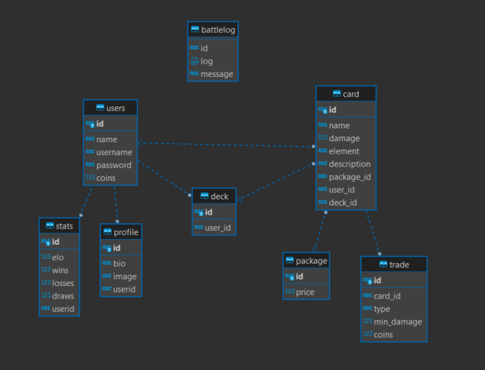

# Technical Implementation
## Designs

### Database Schema

[Migration Script](./docs/migration.sql)

The code is mainly structured into:
- Controllers
- Dao
- Dto
- Models
- Service

The Dao accesses the data from the database. Services use the Daos and offer methods that build on top of the Dao Methods. The Service layer is then used by the controllers.

The Game Queueing system is implemented with the Consumer/Producer pattern where the clients are producers and the server is the consumer of the clients and with them creates games. For the Queue I used a   `BlockingQueue` that takes `QueueUser`'s a `QueueUser` consists of `User` and another `BlockingQueue<Response>` that has an capacity of 1. The Queue from the Queue User is used to offer a two way communication and to synchronize the threads. After joining a game every `QueueUser` calls `take` on their Response Queue and waits for the game to finish.

## Features
- **Mandatory feature**
    - After every Battle the battle log is stored in the database and all users can access existing battle logs by the game id on the route `GET /battles/:game_id`
- **Optional features**
    - Trading system: trade cards vs coins
        - A user can create a coin trade on the same route as the card trade `POST /tradings` only that in this case a coins property must be provided in the Request Body along with the card id to trade
    - Card Description
        - A Card can have a description that can be set by an admin on the route `PATCH /cards/:card_id`
    - Implemented a more sophisticated Elo System [Chess Elo System](https://de.wikipedia.org/wiki/Elo-Zahl)https://de.wikipedia.org/wiki/Elo-Zahl
    - Added Win/Lose Ratio to user stats

## Failures and Solutions

The biggest bottleneck of the Project was definitely the Game Queue System the first implementation was not very performant and wasted resources Busy looping and checking for Keys in a HashMap. On top of that the code was not thread safe and could lead to clients being stuck in the queue forever. The second Iteration of the Game Queue System still had problems where users could end up being queued for a battle the last although they were the first to search for the game.

The solution for the Problem was implementing the Consumer/Producer Pattern

# Testing

When I wrote the tests I started with writing tests for the `CardController`, `UserController`, `GameController`, `TradingController`. Mainly I tested if the right errors are returned for edge cases e.g. buying a package that was already bought in the time of the Request. In addition I wrote tests for the Game Queue to check whether a predefined number of players X that join a queue are getting placed into a match. Furthermore, I wrote tests for the Elo System to ensure that the elo is calculated correctly and that the user stats are updated.

The tested code is critical since if edge cases are not tested properly it could lead to bugs where users could abuse the system. The tests for the Game Queue are also of high importance since it is the heart of the game and it is essential that users can join the game queue to be matched against other players.

# Time Spent

Around 60h (Git history more detailed with commits)
